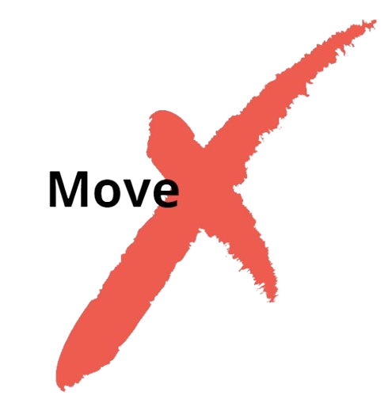

# MoveX: Fitness App
## Projeto PDM




MoveX é um aplicativo de acompanhamento de atividades físicas, metas e gráficos para ajudar usuários a adotarem e manterem uma rotina saudável. 

## 📋 Descrição do Projeto

A crescente prevalência de um estilo de vida sedentário representa um desafio significativo na sociedade contemporânea, afetando negativamente o bem-estar físico e mental dos indivíduos. Muitas pessoas consideram um desafio estabelecer hábitos regulares de atividade física, muitas vezes devido à motivação insuficiente, objetivos pouco claros ou obstáculos na monitorização do seu progresso. Além disso, muitos aplicativos atuais não conseguem fornecer uma experiência personalizada ou coisa que integre a segmentação de metas, o rastreamento abrangente e a avaliação visual do desempenho.

## 🚀 Funcionalidades

- Definição de metas de atividades físicas.
- Monitoramento de progresso com gráficos detalhados.
- Integração com dispositivos de fitness.
- Notificações e lembretes personalizados.
- Personalização de metas para diferentes níveis de usuário.

## 🛠️ Tecnologias Utilizadas

- **Linguagem:** Kotlin
- **Interface:** Jetpack Compose
- **IDE:** Android Studio
- **Banco de Dados:** Firebase

## 🏗️ Arquitetura

- **Frontend:** Desenvolvido em Jetpack Compose.
- **Backend:** API RESTful em Spring Boot.
- **Banco de Dados:** ?
- **Camadas:** Interface do Usuário, Lógica de Negócio, Persistência de Dados.

## 📊 Diagramas

1. **Diagrama de Caso de Uso:** [Ver diagrama]()

## 📱 Wireframes

Os wireframes do aplicativo estão disponíveis em [./wireframes](https://www.figma.com/design/xWQJznz8mutse06dE3eV9j/MoveX?node-id=0-1&t=x4FJ5V8PjOegChYu-0).

## 🔧 Como Rodar o Projeto

1. Clone o repositório:
   ```bash
   git clone https://github.com/BielzinDaAgua/MoveX.git
